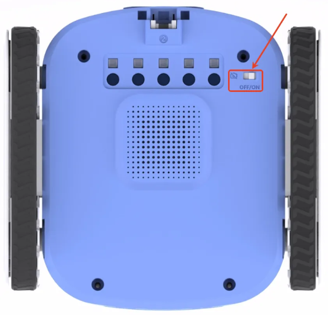

# Hardware-Related Issues
## The robot cannot control modules (e.g., launcher or gripper) after connection
+ Damaged cable: Try replacing the cable with one that works on another device. If it works, the original cable is faulty and should be replaced.
+ Module failure: If changing the cable does not resolve the issue, try replacing the module with one that works on another device. If the new module works, the original module is defective—please contact customer support for after-sales service.
+ Robot port failure: If both the cable and module are functioning, try switching to a different port on the robot. If it works, the original port is faulty—please contact customer support for after-sales service.

## Module (gripper or launcher) behaves abnormally after prolonged use
+ These modules have a thermal protection mechanism. Prolonged use may cause the internal motor to overheat and trigger the protection.
+ Solution: Allow the module to rest and cool down before using it again. If the issue persists after cooling, please contact customer support.

## Robot malfunctions (e.g., freezing or no response) after long periods of operation
+ The robot may have overheated. Let it cool down and restart it. If the issue persists after cooling, please contact customer support.

## Camera or microphone not functioning

+ Check the “Privacy Switch” located at the bottom of the robot.
+ If the switch is set to OFF, both the camera and microphone will be disabled.
+ To enable them, switch it to ON. The privacy switch is a physical toggle that controls the power supply to the camera and microphone system.

## Poor performance during line-following with the 5-way color & grayscale sensor
+ Low battery levels may affect motor performance.
+ Recommendation: Fully charge the robot before using the line-following function. If the battery is below 30%, avoid running the line-following program.

## Inaccurate color recognition with the 5-way color & grayscale sensor
+ Environmental lighting can affect recognition accuracy.
+ Solution: Use the “Color Learning” feature in the ICreateCode software.
+ Place the 5-way sensor over the target color (e.g., red), and run the program “Train Line Sensor to Recognize [Red] Color.”
+ After the sensor finishes blinking, the learning is complete.
+ If the issue persists, contact customer support.

## The camera or microphone is not functioning properly.
+ Please check whether the privacy switch at the bottom of the robot is turned on. The camera and microphone can only function normally when the privacy switch is enabled.

