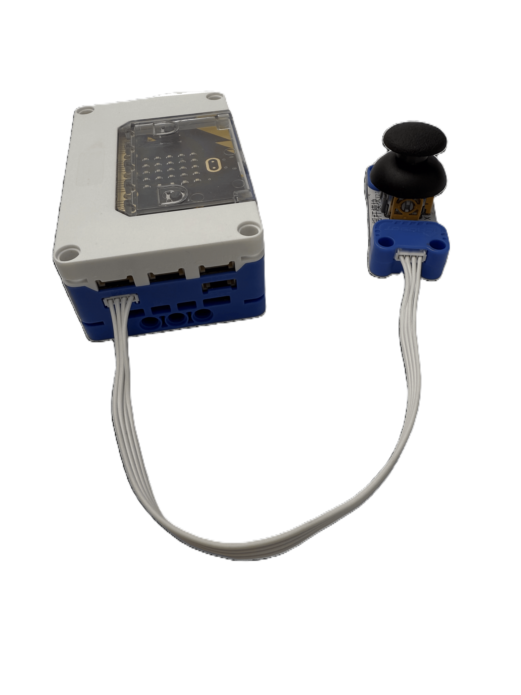
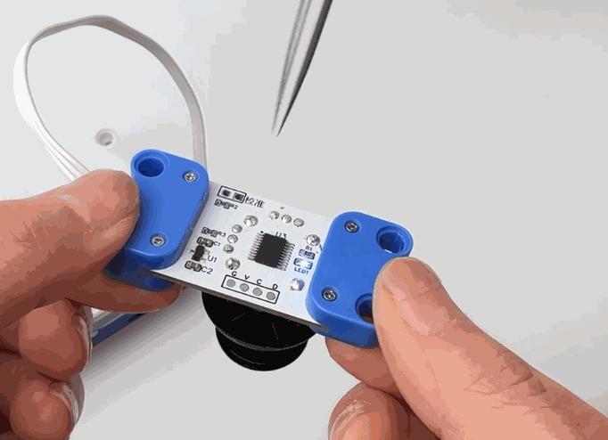
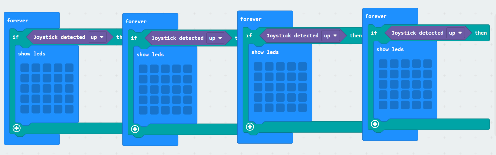
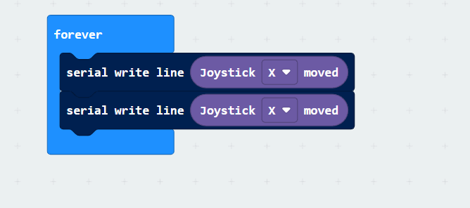

# Joystick Module
## Introduction  
The joystick module is a commonly used electronic input device, primarily designed for directional and amplitude control. It consists of a movable joystick and an internal potentiometer. When the joystick is tilted, its position changes the resistance value of the potentiometer.  

## Specifications  
| Item | **Description** |
| :---: | :---: |
| Name | Joystick Module |
| Code | B0020029 |
|  Dimensions   | 51×24×34 mm |
|  Voltage   | 5V－DC |
|  Control Signal   | I²C |
|  X / Y Axis Detection Range   | -100~100 |
| Ports | Grove |

## **Usage**
|  | | |
| :---: | --- | --- |
|  |  |  |
| _Side View_ | _Front View_ | _Side View_ |
| Joystick Module Connection Diagram | | |

The joystick module can be connected to the **I²C interface** of the **micro: bit hub**. In the coding environment, the position of the joystick can be read and utilized.  

If the joystick module exhibits accuracy deviations, calibration can be performed using tweezers: Short-circuit the calibration pads with tweezers. The indicator light will start flashing, indicating calibration mode. Perform a full **360° rotation** of the joystick. After completing the rotation, remove the tweezers. When the indicator light turns solid, calibration is successful.

## Modular Coding  

Using the **MakeCode** coding software, the Microbit extension allows:

Reading directional signals from the joystick module through the **I²C port** and displaying them on the **micro: bit LED matrix**.

Reading positional values from the joystick module through the **I²C port** and writing them to the serial port.  

