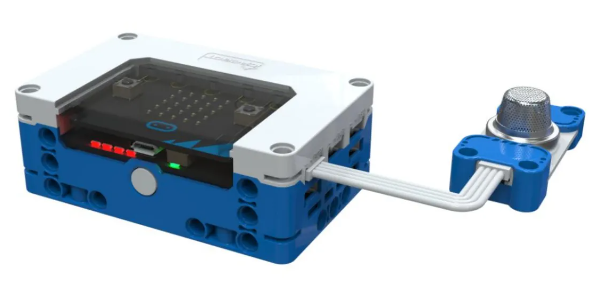
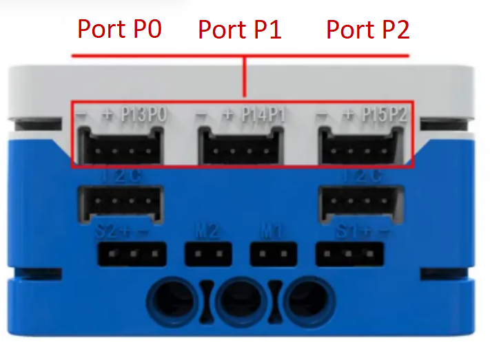
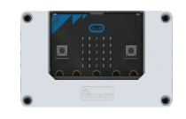
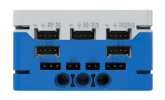
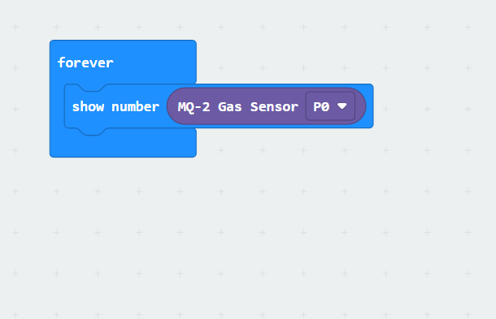

# MQ-2 Gas Sensor
## Principle  
The MQ-2 Gas Sensor uses tin dioxide (SnO2) with low conductivity as the sensitive material. When combustible gases are present in the environment, the sensor's conductivity significantly increases with the concentration of the gas. This sensor is highly sensitive to liquefied gas, propane, and hydrogen, while also performing well in detecting natural gas and other combustible vapors.  

## Specifications
| Item | **Description** |
| :---: | :---: |
| Name | MQ-2 Gas Sensor |
| Code | B0020005 |
| Dimension | 40×24×12 mm |
| Voltage | 5V - DC |
| Ports | Grove |
|  Data Type   | Analog Signal   |
|  Data Range   | 0~1023 |

## **Usage**
| <!-- 这是一张图片，ocr 内容为： -->
 | | |
| :---: | --- | --- |
| <!-- 这是一张图片，ocr 内容为： -->
 | <!-- 这是一张图片，ocr 内容为： -->
 | <!-- 这是一张图片，ocr 内容为： -->
 |
| _Side View_ | _Front View_ | _Side View_ |
| **MQ-2 Gas Sensor Connection Diagram** | | |

The combustible gas sensor can be connected to the P0, P1, and P2 interfaces of the micro:bit smart hub. In the coding environment, the analog values of the combustible gas sensor can be read. Its characteristic is that the sensor's output increases with the concentration of combustible gas; conversely, when the gas concentration decreases, the detected value decreases accordingly.  

> **Note: It is normal for the sensor to heat up during use. If overheating occurs, please stop using it immediately to avoid burns.**
>

## **Modular Coding**
<!-- 这是一张图片，ocr 内容为： -->

In the MakeCode coding software, the sensor signal value from the P0 port can be read using the micro:bit extension. The data can then be visualized on the micro:bit's LED matrix. 

