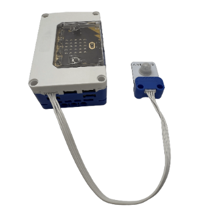
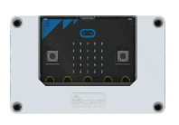
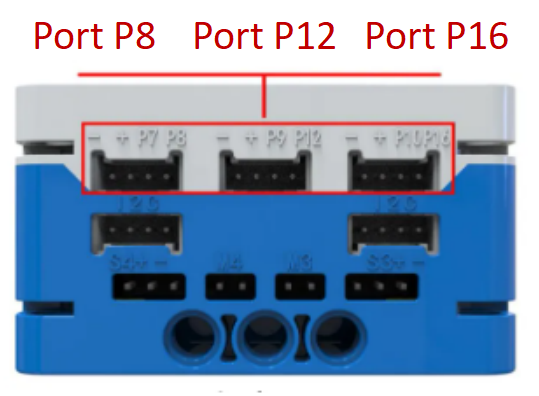
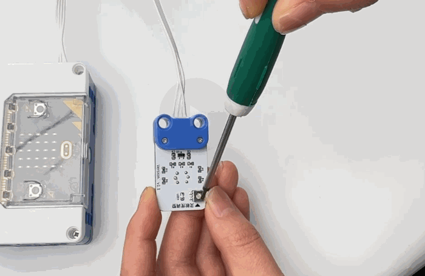
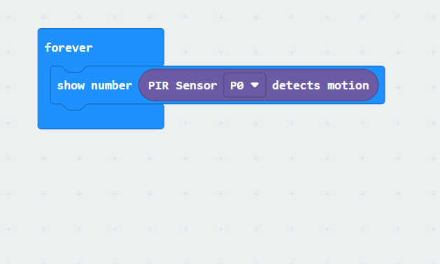

# PIR Sensor
## **Principle**
The PIR Sensor (Passive Infrared  Radiation Sensor) is an electronic component based on the NS612 pyroelectric digital intelligent sensor. It is capable of detecting infrared radiation emitted by moving infrared sources (such as the human body), thereby sensing the presence of the infrared source.  

## Specifications  
| Item | **Description** |
| :---: | :---: |
| Name | PIR Sensor |
| Code | B0020028 |
|  Dimensions   | 28×24×12 mm |
| Voltage | 5V－DC |
| Data Type |  Analog Signal |
|  Data Range   | 0 or 1 |
| Ports | Grove |

## **Usage**
|  <!-- 这是一张图片，ocr 内容为： -->
 | | |
| :---: | --- | --- |
| <!-- 这是一张图片，ocr 内容为： -->
 | <!-- 这是一张图片，ocr 内容为： -->
 | <!-- 这是一张图片，ocr 内容为： -->
 |
| _Side View_ | _Front View_ | _Side View_ |
| PIR Sensor Connection Diagram | | |

The PIR sensor can connect to the **I²C interface** of the **micro:bit hub**. In the coding environment, the sensor values can be read:

+ When the sensor detects a moving infrared source, the blue LED indicator lights up and outputs a signal value of **0**.
+ If no moving infrared source is detected, the blue LED turns off and outputs a signal value of **1**.

<!-- 这是一张图片，ocr 内容为： -->

The PIR sensor is equipped with a **linear potentiometer** located on the back for fine sensitivity adjustments:

+ Rotate the potentiometer **clockwise** to increase sensitivity and extend the detection range.
+ Rotate it **counterclockwise** to decrease sensitivity and shorten the detection range.

## Modular Coding  
<!-- 这是一张图片，ocr 内容为： -->

In the MakeCode coding software, by adding the micro:bit extension, you can code the system to read the PIR sensor signal from the P0 port and visualize the data on the micro:bit's LED display.

