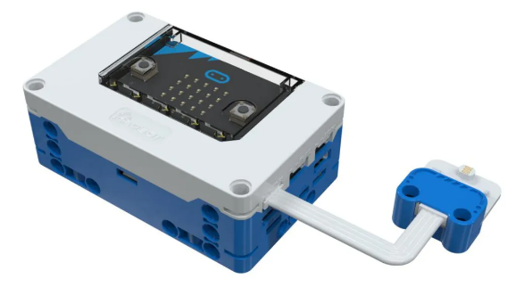
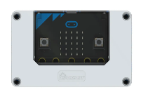
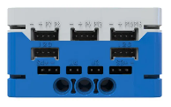
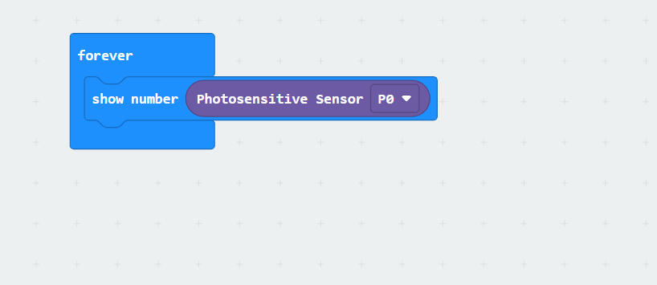

# Photosensitive Sensor
## **Principle**
The Photosensitive Sensor is a device that converts light signals into electrical signals using a photosensitive element. In this sensor, there is an inverse relationship between the light intensity and the returned value: the stronger the light, the smaller the returned value; the weaker the light, the larger the returned value.  

## Specifications
| Item | **Description** |
| :---: | :---: |
| Name | Photosensitive Sensor |
| Code | B0020013 |
| Dimension | 28×24×12 mm |
| Voltage | 5V - DC |
| Ports | Grove |
|  Data Type   | Analog Signal   |
|  Data Range   | 0~1023 (Bright ~ Dark)   |

## **Usage**
| <!-- 这是一张图片，ocr 内容为： -->
 | | |
| :---: | --- | --- |
| <!-- 这是一张图片，ocr 内容为： -->
 | <!-- 这是一张图片，ocr 内容为： -->
 | <!-- 这是一张图片，ocr 内容为： -->
 |
| _Side View_ | _Front View_ | _Side View_ |
| **Photosensitive Sensor Connection Diagram** | | |

The photosensitive sensor can be connected to the P0, P1, and P2 interfaces of the micro:bit smart hub. In the coding environment, users can read the analog values from the sensor. Its characteristic is that the stronger the light, the higher the value output by the sensor; conversely, in a darker environment, the sensor's output value decreases.

## **Modular Coding**
<!-- 这是一张图片，ocr 内容为： -->

In the MakeCode coding software, the sensor signal value from the P0 port can be read using the micro:bit extension. The data can then be visualized on the micro:bit's LED matrix. 

