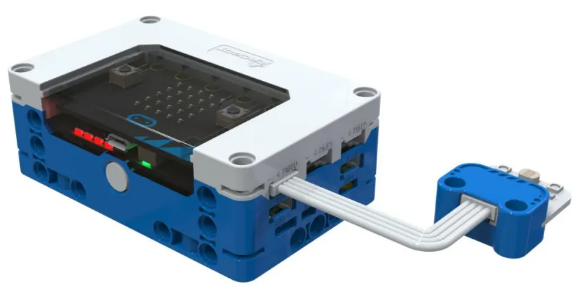
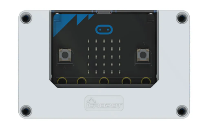
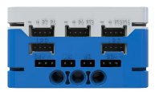
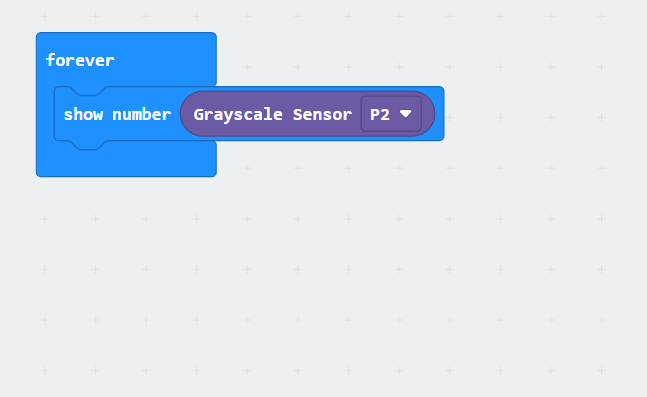

# Grayscale Sensor
## **Principle**
The Grayscale Sensor is equipped with two high-brightness white LEDs and a photosensitive resistor. When the light emitted by the LEDs strikes surfaces with different reflectivity, the intensity of the reflected light will vary. The resistance of the photosensitive resistor changes according to the intensity of the received light, thereby reflecting the grayscale value of the surface being measured.  

## Specifications
| Item | **Description** |
| :---: | :---: |
| Name | Grayscale Sensor |
| Code | B0020007 |
| Dimension | 28×24×12 mm |
| Voltage | 5V - DC |
| Ports | Grove |
|  Data Type   | Analog Signal   |
|  Data Range   | 0~1023 (Black ~ White)   |

## **Usage**
| <!-- 这是一张图片，ocr 内容为： -->
 | | |
| :---: | --- | --- |
| <!-- 这是一张图片，ocr 内容为： -->
 | <!-- 这是一张图片，ocr 内容为： -->
 | <!-- 这是一张图片，ocr 内容为： -->
 |
| _Side View_ | _Front View_ | _Side View_ |
| **Grayscale Sensor Connection Diagram** | | |

The grayscale sensor can be connected to the P0, P1, and P2 interfaces of the micro:bit smart hub. In the coding environment, users can read the analog values of the grayscale sensor. Its characteristic is that the stronger the reflected light, the higher the output value of the grayscale sensor. Conversely, the weaker the reflected light, the smaller the output value of the grayscale sensor.  

## Modular Coding  
<!-- 这是一张图片，ocr 内容为： -->

In the MakeCode coding software, the sensor signal value from the P0 port can be read using the micro:bit extension. The data can then be visualized on the micro:bit's LED matrix. 

