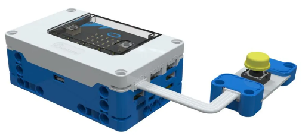
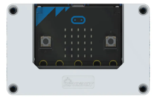
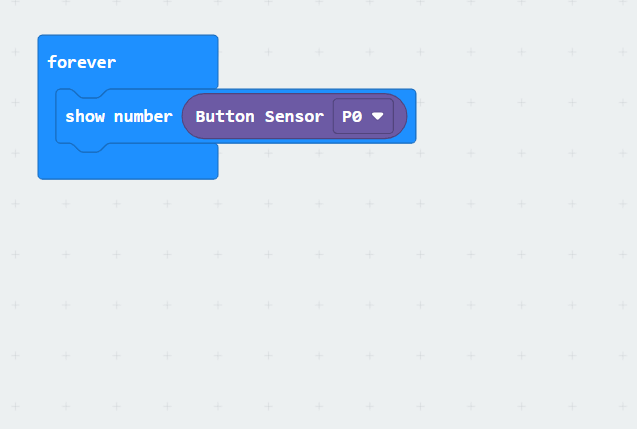

# Button Sensor
## Principle
The Button Sensor is a push-type switch digital input module. When not pressed, the sensor contacts are separated, the circuit is not connected, and it outputs a low-level signal. When the button is pressed, the contacts are connected, the circuit is closed, and it outputs a high-level signal. The button sensor switches the level signal when pressed and is widely used in switch control and device startup scenarios.

## Specifications
| Item | **Description** |
| :---: | :---: |
| Name | Button Sensor |
| Code | B0020003 |
| Dimension | 56×24×12mm |
| Voltage | 5V－DC |
|  Data Type | Digital Signal |
|  Data Range | 0 or 1 |
| Ports | HY2.0-4P  |

## **Usage**
| <!-- 这是一张图片，ocr 内容为： -->
 | | |
| :---: | --- | --- |
| <!-- 这是一张图片，ocr 内容为： -->
 | <!-- 这是一张图片，ocr 内容为： -->
 | <!-- 这是一张图片，ocr 内容为： -->
 |
| Side View | Front View | Side View |
| Button Sensor Connection Diagram | | |

The button sensor can be connected to the ordinary sensor interfaces of the micro:bit smart hub, such as P0, P1, P2, P8, P12, and P16. You can program to read the status of the button sensor. When the button is pressed, the button sensor outputs "0". When the button is released, the button sensor outputs "1".  

## Modular Coding  
<!-- 这是一张图片，ocr 内容为： -->

In the MakeCode programming software, by adding the Microbit extension, you can program to read the signal value of the button sensor from the P0 port and visualize this data on the micro:bit's LED matrix display.  

